# TikiTaka

**Type less. Work faster.**

A text expander and clipboard history manager for people who type the same things every day — built from day 1 for real multilingual workflows (Korean, English, Chinese, Japanese) without giving up on keyboard-first ergonomics.

  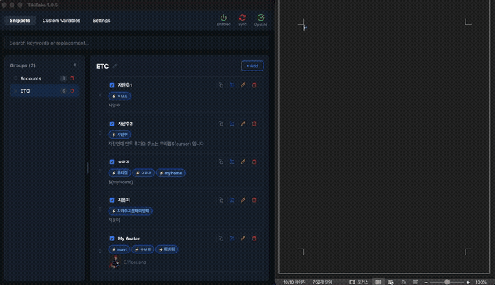

  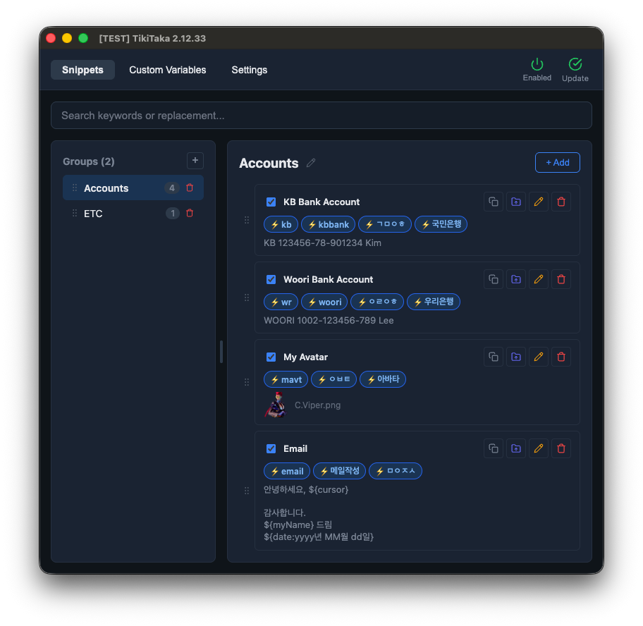
  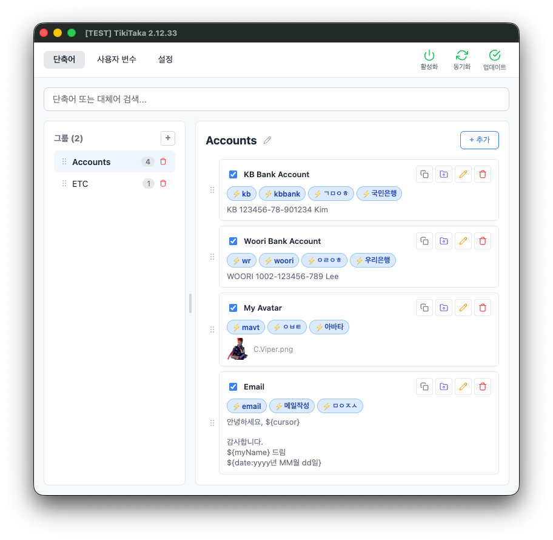

  Windows & macOS &nbsp;·&nbsp; Light / Dark theme &nbsp;·&nbsp; English / 한국어 UI

---

<b>🇺🇸 English</b>

 

## Why TikiTaka

You already know the pain.

- Retyping your address, bank account, email signature, and the same boilerplate replies a dozen times a day.
- Hopping between a browser tab and your editor, copying one thing at a time, losing your place on the way back.
- Digging through a Notes file to find that one code snippet you wrote last week.

TikiTaka turns that friction into a **single shortcut** — and wraps a proper clipboard history around it, so the thing you just copied is never more than one keystroke away.

## A few real moments

**Answering the same questions, fifty times a day.** You run customer support. Half your day is typing variants of the same six answers. Register them as `q1`–`q6`. Type the keyword, hit `Ctrl + \`, and the full reply lands in the chat — formatting intact, your signature auto-filled from a shared `${signature}` variable.

**Pulling research from a single page.** You're writing a report and need five different passages from one long article. The old workflow is five round trips: copy, switch to the doc, paste, go back, scroll, copy, switch, paste — and somewhere in the middle you lose your place. With TikiTaka, you copy everything you need from the article in one pass. Then you open the doc, press the clipboard history shortcut, and the last several copies are sitting in a list with a full preview on the right. Pick the one you want — or **drag-select just the sentence you need** from the preview — and paste.

**Filling the same bank transfer form for the hundredth time.** Type `ㄱㅁ`. Your bank name, account number, and account holder appear — matched by Korean initial consonants, without typing the full `국민은행`.

## What makes TikiTaka different

### Korean input, done right

Most text expanders break the moment you start typing Korean, because Korean characters are assembled from jamos on the fly. TikiTaka is built for this from day 1.

- **Triggers mid-composition** — fires even while the final jamo is still being assembled, so you never have to pause your typing rhythm
- **Forgiving of typos mid-word** — mistyped something in the middle of the keyword and backspaced to fix it? As long as the completed keyword is sitting right before your cursor when you trigger, it still works.
- **Initial-consonant search (초성)** — type `ㄱㅁ` to pull up `국민은행` or `고맙습니다`
- Mix Korean, English, Chinese, and Japanese keywords freely inside a single shortcut

### A clipboard history you drive with the keyboard

  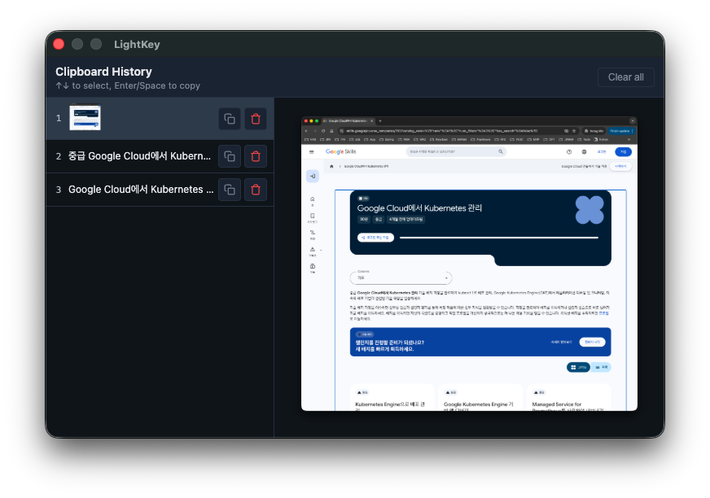

A full clipboard manager, living inside the text expander.

- Press your shortcut and a focused popup appears instantly — list on the left, full preview on the right
- `↑ / ↓` to navigate, `Enter` or `Space` to paste the selected item — no mouse required
- **Drag-select inside the read-only preview** to paste only the fragment you actually need, instead of the whole thing
- **Copy as plain text** — strip formatting with a single click when you need clean text
- Per-item delete and a clear-all button to keep things tidy
- Automatic LRU ordering — the item you just used bubbles to the top

### Variables that scale with you

  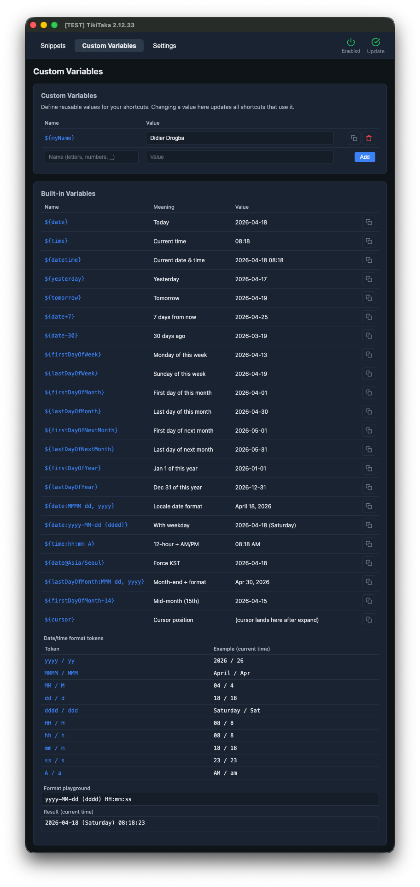

- Define `${email}`, `${phone}`, `${company_addr}` once and reference them in any shortcut
- Change a value in one place, and every shortcut that uses it updates instantly
- Built-in date and time tokens — `${date}`, `${time}`, `${datetime}`, `${firstDayOfMonth:yyyy-MM-dd}`, and more
- Month name tokens: `${date:MMMM dd, yyyy}` → "April 17, 2026"
- Per-variable timezone override: `${date@Asia/Seoul}`, `${time@UTC}`
- Live format playground so you can test a token before committing to it

### Find anything in a flash

  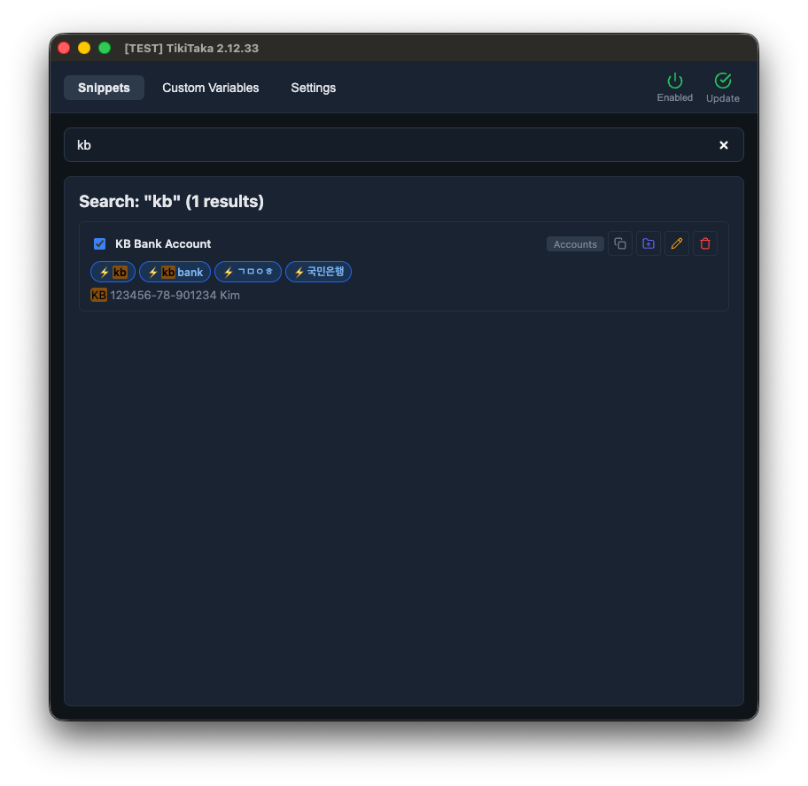

Hundreds of shortcuts? Type a fragment of the keyword or the replacement text. Results are ranked by relevance, and typos are forgiven.

### Image shortcuts, not just text

- Register PNG, JPG, GIF, BMP, and WebP images as shortcuts
- Drag & drop to set them up
- Type the keyword, trigger, done — the image lands on the clipboard, ready to paste anywhere

## Everything else

- **Groups** — organize shortcuts by context (work, personal, code, support)
- **ON / OFF toggles** — flip entire groups or individual shortcuts on and off
- **Drag & drop** — reorder groups and shortcuts in seconds
- **Move between groups** — reorganize without retyping anything
- **ZIP backup** — export and re-import your full library (shortcuts + images) as a single file
- **Themes** — light, dark, or follow the system
- **Auto-launch** — lives in the system tray, ready when you boot
- **In-app auto-update** — never miss a release

## Settings

  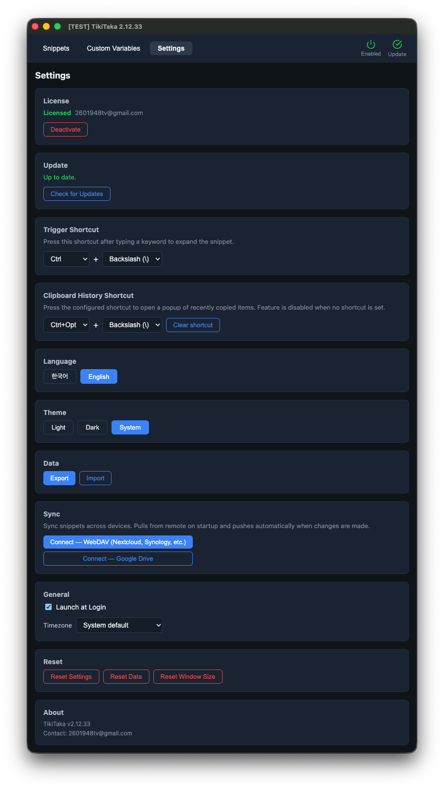

Configure your trigger shortcut, clipboard history shortcut, theme, language, and auto-launch — all in one screen.

## Download

Grab the latest build from the [Releases](https://github.com/soon83/tikitaka/releases) page.

| Platform | File |
|----------|------|
| Windows | `TikiTaka.Setup.x.x.x.exe` |
| macOS (Apple Silicon) | `TikiTaka-x.x.x-arm64.dmg` |

## Pricing

**Free** — everything you need to try TikiTaka:
- 1 group, up to 10 shortcuts
- Clipboard history
- Custom variables
- Local-first, no telemetry
- Lifetime updates

**Pro — one-time purchase — everything in Free, plus:**
- Unlimited groups & shortcuts
- Cloud sync — Google Drive or WebDAV
- **Lifetime license. No subscription, ever.** Every future update is included — new features, bug fixes, performance improvements. No re-purchase, no upgrade fees, no tiered pricing creep.
- **One active device at a time.** Deactivate from within the app (Settings → License) to move the license to another machine. Deactivated devices revert to Free.
- **14-day refund, no questions asked.** See [refund policy](https://soon83.github.io/tikitaka/terms.html#refund-policy).

Upgrade from within the app — Settings → License → Buy Pro.

## Built with your feedback

TikiTaka is actively developed, and the roadmap is shaped by the people who actually use it. If you run into something you wish worked differently, or you have an idea for a feature that would fit into your workflow, [open an issue](https://github.com/soon83/tikitaka/issues/new/choose) — every suggestion gets read and weighed, and the good ones ship.

## Windows installation notice

When you run `TikiTaka.Setup.x.x.x.exe`, **Windows Defender SmartScreen** may show:

> "Windows protected your PC"

TikiTaka is not signed with a paid code-signing certificate, but it is not malware.

**How to install:**
1. Click **"More info"** on the warning dialog
2. Click **"Run anyway"** at the bottom

The warning will not appear again after the first run.

## System requirements

| Platform | Minimum |
|----------|---------|
| Windows | 10 or later |
| macOS | 12 (Monterey) or later, Apple Silicon |

> macOS: grant TikiTaka permission under **System Settings > Privacy & Security > Accessibility**.

## Support

- Bug reports & feature requests: [GitHub Issues](https://github.com/soon83/tikitaka/issues/new/choose)
- General inquiries: **2601948tv@gmail.com**

---

## Privacy Policy

*Last updated: April 12, 2026*

### Data We Collect

**License Verification**
When you activate a premium license, TikiTaka sends a hashed machine identifier (SHA-256 fingerprint) and your license key to LemonSqueezy's API for validation. No personally identifiable information is included in this request.

**Update Checks**
TikiTaka periodically checks the GitHub Releases API to determine if a newer version is available. Only the current app version is sent; no personal data is transmitted.

**Payment Information**
All payments are processed entirely by [LemonSqueezy](https://www.lemonsqueezy.com). TikiTaka never collects, stores, or has access to your credit card, billing address, or other payment details.

### Data We Do NOT Collect

- **No analytics or telemetry** — TikiTaka does not track usage patterns, feature usage, or session data.
- **No keystroke logging** — Keyboard input is processed locally in real-time for keyword matching and is never recorded, stored, or transmitted.
- **No snippet data transmission** — All shortcuts, groups, and images are stored locally on your device and are never sent to any server.

### Data Storage

All user data (snippets, settings, images) is stored locally in the application data directory on your device. TikiTaka does not operate any cloud storage or synchronization service.

### Third-Party Services

| Service | Purpose | Their Privacy Policy |
|---------|---------|----------------------|
| [LemonSqueezy](https://www.lemonsqueezy.com) | Payment processing & license management | [lemonsqueezy.com/privacy](https://www.lemonsqueezy.com/privacy) |
| [GitHub](https://github.com) | Application distribution & update checks | [docs.github.com/site-policy/privacy-policies](https://docs.github.com/en/site-policy/privacy-policies/github-general-privacy-statement) |

### Contact

For privacy-related questions, contact **2601948tv@gmail.com**.

---

## Terms of Service

*Last updated: April 12, 2026*

### License

- **Free tier**: 1 group, up to 10 shortcuts. No purchase required.
- **Pro**: Unlimited groups and shortcuts, plus cloud sync (Google Drive / WebDAV). **one-time purchase**, lifetime license — not a subscription.
- **Lifetime updates** are included for both Free and Pro — you keep getting new features and bug fixes for as long as TikiTaka is developed.
- A Pro license is activated on **one device at a time**. Deactivate from within the app (Settings → License) to move the license to another machine. Deactivating reverts the device to the Free tier.

### Acceptable Use

You agree not to:
- Reverse-engineer, decompile, or disassemble the software
- Redistribute, resell, or sublicense the software or license keys
- Use the software for any unlawful purpose

### Intellectual Property

TikiTaka and all associated content are the property of the developer. Your license grants you the right to **use** the software, not ownership of it.

### Disclaimer

TikiTaka is provided **"as is"** without warranty of any kind, express or implied. The developer is not liable for any damages arising from the use of this software, including but not limited to data loss or system issues.

### Updates

Updates are provided at the developer's discretion and are delivered through the built-in auto-update feature. The developer reserves the right to modify features in future versions.

### Changes to Terms

These terms may be updated at any time. Continued use of the software after changes constitutes acceptance of the updated terms.

---

## Refund Policy

- **14-day refund, no questions asked** — Request a full refund within 14 days of purchase by emailing **2601948tv@gmail.com**. No justification required.
- **Free tier available** — TikiTaka offers a free tier so you can evaluate the software before purchasing. We encourage you to try before you buy.
- **How to request** — Send an email including your license key or order number. Refunds are typically processed within 3 business days via the original payment method (Lemon Squeezy).
- **After refund** — Your license is invalidated and cloud sync credentials stored on your devices are automatically removed on the next license revalidation (within 24 hours).
- **After 14 days** — Refund requests after the 14-day window are handled on a case-by-case basis.

<b>🇰🇷 한국어</b>

 

## 왜 TikiTaka인가

아마 이미 겪고 계실 겁니다.

- 주소, 계좌번호, 이메일 서명, 같은 보일러플레이트 답변을 하루에도 수십 번 다시 입력
- 브라우저 탭과 편집기 사이를 오가며 한 번에 하나씩 복사·붙여넣기, 그러다 하던 작업의 맥락을 잃기
- 지난주에 써둔 코드 한 조각을 찾으려고 메모장을 뒤지기

TikiTaka는 이 마찰을 **단축키 한 번**으로 바꿉니다. 그리고 그 위에 제대로 된 클립보드 히스토리까지 얹어, 방금 복사한 내용이 언제든 한 번의 키 입력 거리에 머무르도록 합니다.

## 실제 사용 장면

**하루에 쉰 번씩 같은 답변을 타이핑하는 상담 업무.** 고객 응대를 하다 보면 여섯 가지 답변의 변주를 온종일 치고 있습니다. `q1`~`q6`으로 등록해 두세요. 키워드 입력 후 `Ctrl + \`를 누르면 서식이 살아 있는 전체 답변이 그대로 들어갑니다. 공유 변수 `${signature}`로 끝맺음 서명까지 자동입니다.

**한 페이지에서 자료 여러 개를 뽑아내야 할 때.** 긴 기사 하나에서 다섯 군데의 문장을 문서로 옮겨야 합니다. 예전이라면 복사 → 문서로 이동 → 붙여넣기 → 다시 기사로 → 스크롤 → 복사 → 이동 → 붙여넣기, 도중에 맥이 끊기기 일쑤입니다. TikiTaka에서는 기사에서 필요한 부분들을 한 번에 쭉 복사한 뒤, 문서를 열고 클립보드 히스토리 단축키를 누릅니다. 최근 복사 기록이 좌측 리스트에, 원문 전체가 우측 상세 영역에 나타납니다. 원하는 항목을 고르거나, **상세 영역에서 필요한 문장만 드래그 선택**해서 붙여넣으면 끝입니다.

**계좌이체 양식을 백 번쯤 채운 날.** `ㄱㅁ`만 입력하면 은행명, 계좌번호, 예금주가 한 번에 나옵니다. 한글 초성으로 매칭하기 때문에 `국민은행`을 풀네임으로 칠 필요가 없습니다.

## 무엇이 다른가

### 한글 입력, 제대로

대부분의 텍스트 확장기는 한글을 치기 시작하는 순간 동작을 멈춥니다. 한글 문자가 자모 단위로 조합되는 중이기 때문입니다. TikiTaka는 처음부터 이걸 전제로 만들어졌습니다.

- **조합 중에도 트리거 동작** — 마지막 받침이 조합되는 중이어도 단축어가 발동합니다. 타이핑 리듬을 끊을 필요가 없습니다
- **중간에 오타를 내도 괜찮습니다** — 단어를 치다가 중간에 잘못 입력했더라도, 백스페이스로 고쳐서 **최종적으로 완성된 키워드가 커서 바로 앞에 있기만 하면** 그대로 트리거됩니다
- **한글 초성 검색** — `ㄱㅁ`을 입력하면 `국민은행`, `고맙습니다`를 찾아줍니다
- 한국어·영어·중국어·일본어 키워드를 하나의 단축어 안에 자유롭게 섞어 쓸 수 있습니다

### 키보드만으로 완결되는 클립보드 히스토리

  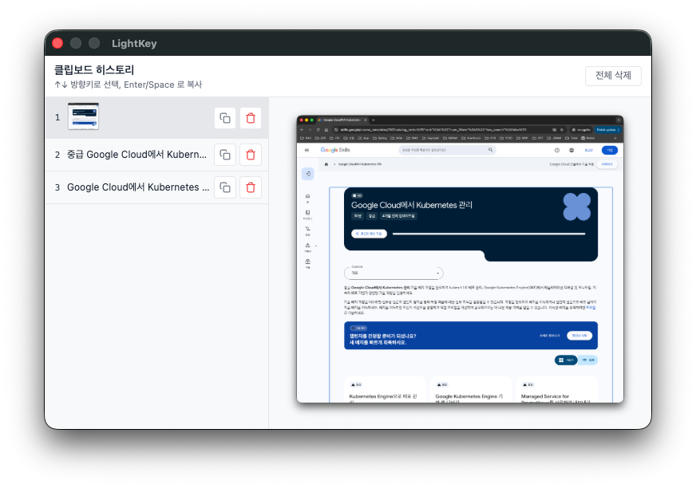

텍스트 확장기 안에 제대로 된 클립보드 매니저가 들어 있습니다.

- 단축키를 누르면 팝업이 즉시 뜹니다 — 좌측에 리스트, 우측에 원문 전체 미리보기
- `↑ / ↓`로 이동, `Enter` 또는 `Space`로 복사 — 마우스 불필요
- **상세 영역에서 드래그 선택**하면 필요한 부분만 부분 복사
- **서식 없이 복사** — 클릭 한 번으로 서식을 제거한 깨끗한 텍스트 복사
- 단건 삭제 / 전체 삭제 버튼으로 히스토리를 깔끔하게 관리
- LRU 자동 정렬 — 방금 사용한 항목이 자동으로 맨 위로

### 확장되는 사용자 변수

  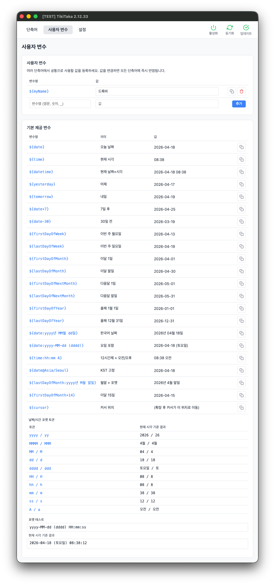

- `${email}`, `${phone}`, `${company_addr}`를 한 번만 정의하고 어느 단축어에서든 참조
- 값을 한 곳에서 바꾸면 그 변수를 쓰는 모든 단축어에 즉시 반영
- 기본 제공 날짜·시간 토큰 — `${date}`, `${time}`, `${datetime}`, `${firstDayOfMonth:yyyy년 M월 1일}` 등
- 월 이름 토큰: `${date:yyyy년 MMMM dd일}` → "2026년 4월 17일"
- 변수별 타임존 오버라이드 — `${date@Asia/Seoul}`, `${time@UTC}`
- 포맷 플레이그라운드에서 토큰을 즉석 테스트

### 순식간의 퍼지 검색

  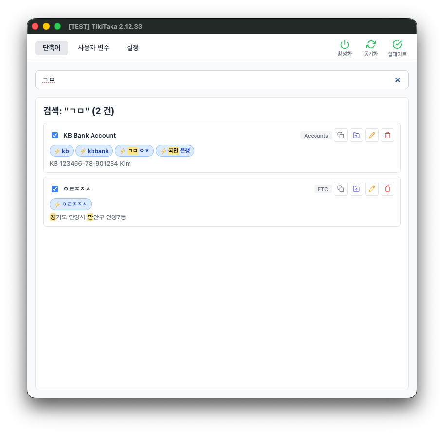

등록된 단축어가 수백 개여도 괜찮습니다. 키워드나 대체어 일부만 입력해도 연관도 순으로 정렬되어 나오며, 오타가 있어도 가장 비슷한 결과를 먼저 보여줍니다.

### 텍스트뿐 아니라 이미지 단축어도

- PNG, JPG, GIF, BMP, WebP 이미지를 단축어로 등록
- 드래그 앤 드롭으로 간편 등록
- 키워드 입력 후 트리거하면 이미지가 클립보드에 올라가 어디든 바로 붙여넣기 가능

## 그 외 모든 것

- **그룹** — 용도별로 단축어를 분류 (업무, 개인, 코드, 상담 등)
- **ON / OFF 토글** — 그룹 또는 개별 단축어를 활성/비활성
- **드래그 앤 드롭** — 그룹과 단축어의 순서를 즉시 변경
- **그룹 간 이동** — 다시 입력할 필요 없이 재정렬
- **ZIP 백업** — 단축어와 이미지를 하나의 파일로 내보내기/가져오기
- **테마** — Light / Dark / System
- **자동 시작** — 시스템 트레이에 상주, 부팅 시 자동 실행
- **앱 내 자동 업데이트** — 새 버전을 놓치지 않습니다

## 설정

  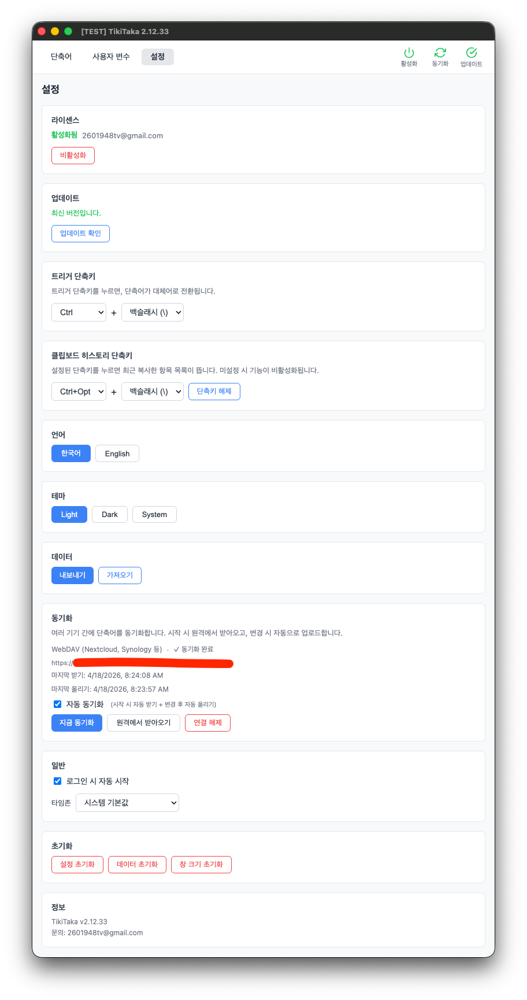

트리거 단축키, 클립보드 히스토리 단축키, 테마, 언어, 자동 시작 등 모든 설정을 한 화면에서 관리합니다.

## 다운로드

[Releases](https://github.com/soon83/tikitaka/releases) 페이지에서 최신 버전을 받을 수 있습니다.

| 플랫폼 | 파일 |
|--------|------|
| Windows | `TikiTaka.Setup.x.x.x.exe` |
| macOS (Apple Silicon) | `TikiTaka-x.x.x-arm64.dmg` |

## 가격

**무료** — TikiTaka 를 직접 써보는 데 필요한 모든 것:
- 그룹 1개, 단축어 최대 10개
- 클립보드 히스토리
- 사용자 변수
- 로컬 우선, 수집 / 추적 없음
- 평생 업데이트

**Pro — 1회 결제 — 무료 플랜의 모든 기능 포함 + 아래 추가:**
- 그룹 · 단축어 무제한
- 클라우드 동기화 (Google Drive · WebDAV)
- **평생 라이선스. 구독 없음.** "한 번 팔고 끝" 이 아닙니다. TikiTaka 가 계속 개발되는 한, 새 기능·버그 수정·성능 개선을 **추가 비용 없이** 계속 받을 수 있습니다. 재구매도, 업그레이드 요금도 없습니다.
- **활성 기기 1대.** 다른 기기로 옮기려면 앱 내에서 비활성화 (설정 → 라이센스) 후 새 기기에서 재활성화하세요. 비활성화된 기기는 무료 플랜으로 되돌아갑니다.
- **14일 환불 보장 (사유 불문).** [환불 정책](https://soon83.github.io/tikitaka/terms.html#refund-policy) 참고

앱 내에서 업그레이드 — 설정 → 라이센스 → Pro 구매.

## 사용자 피드백 기반 개발

TikiTaka는 지금도 활발히 개발 중이며, 로드맵은 실제로 TikiTaka를 사용하는 사람들의 목소리로 만들어집니다. "이 부분이 이렇게 동작했으면 좋겠다" 거나 내 워크플로에 맞는 새 기능 아이디어가 있다면 [이슈를 남겨주세요](https://github.com/soon83/tikitaka/issues/new/choose). 모든 제안은 읽고 검토되며, 적합한 것은 실제로 반영됩니다.

## Windows 설치 안내

`TikiTaka.Setup.x.x.x.exe`를 실행하면 **Windows Defender SmartScreen**에서 아래 경고가 나올 수 있습니다.

> "Windows에서 PC를 보호했습니다"

TikiTaka가 유료 코드 사이닝 인증서로 서명되어 있지 않기 때문이며, 악성 코드와는 무관합니다.

**설치 방법:**
1. 경고 창에서 **"추가 정보"** 클릭
2. 하단의 **"실행"** 버튼 클릭

한 번 설치한 뒤에는 다시 뜨지 않습니다.

## 시스템 요구 사항

| 플랫폼 | 최소 버전 |
|--------|----------|
| Windows | 10 이상 |
| macOS | 12 (Monterey) 이상, Apple Silicon |

> macOS: **시스템 설정 > 개인 정보 보호 및 보안 > 손쉬운 사용**에서 TikiTaka 권한을 허용해야 합니다.

## 문의 및 지원

- 버그 제보 및 기능 제안: [GitHub Issues](https://github.com/soon83/tikitaka/issues/new/choose)
- 일반 문의: **2601948tv@gmail.com**

---

## 개인정보처리방침

*최종 수정: 2026년 4월 12일*

### 수집하는 정보

**라이선스 인증**
프리미엄 라이선스 활성화 시, 기기 식별을 위한 해시 값(SHA-256 핑거프린트)과 라이선스 키를 LemonSqueezy API로 전송합니다. 개인 식별 정보는 포함되지 않습니다.

**업데이트 확인**
TikiTaka는 GitHub Releases API를 주기적으로 호출하여 새 버전 여부를 확인합니다. 현재 앱 버전만 전송되며, 개인 정보는 전송되지 않습니다.

**결제 정보**
모든 결제는 [LemonSqueezy](https://www.lemonsqueezy.com)를 통해 처리됩니다. TikiTaka는 신용카드, 청구 주소 등 결제 정보를 수집·저장·접근하지 않습니다.

### 수집하지 않는 정보

- **분석/텔레메트리 없음** — 사용 패턴, 기능 사용 빈도, 세션 데이터를 추적하지 않습니다.
- **키 입력 기록 없음** — 키보드 입력은 키워드 매칭을 위해 로컬에서 실시간 처리되며, 기록·저장·전송되지 않습니다.
- **단축어 데이터 전송 없음** — 모든 단축어, 그룹, 이미지는 사용자 기기에만 저장되며 외부 서버로 전송되지 않습니다.

### 데이터 저장

모든 사용자 데이터(단축어, 설정, 이미지)는 사용자 기기의 앱 데이터 디렉토리에 로컬 저장됩니다. TikiTaka는 클라우드 저장소나 동기화 서비스를 운영하지 않습니다.

### 제3자 서비스

| 서비스 | 용도 | 개인정보처리방침 |
|--------|------|-----------------|
| [LemonSqueezy](https://www.lemonsqueezy.com) | 결제 및 라이선스 관리 | [lemonsqueezy.com/privacy](https://www.lemonsqueezy.com/privacy) |
| [GitHub](https://github.com) | 앱 배포 및 업데이트 확인 | [docs.github.com/site-policy/privacy-policies](https://docs.github.com/en/site-policy/privacy-policies/github-general-privacy-statement) |

### 문의

개인정보 관련 문의: **2601948tv@gmail.com**

---

## 이용약관

*최종 수정: 2026년 4월 12일*

### 라이선스

- **무료**: 그룹 1개, 단축어 최대 10개. 구매 불필요.
- **Pro**: 그룹 · 단축어 무제한 + 클라우드 동기화 (Google Drive · WebDAV). **1회 결제**, 평생 라이선스 — 구독 아님.
- **평생 업데이트**는 무료 · Pro 양쪽 모두 동일하게 포함됩니다. TikiTaka 가 개발되는 한 새 기능과 버그 수정을 계속 받을 수 있습니다.
- Pro 라이선스는 **한 번에 1기기**에서 활성화됩니다. 다른 기기로 옮기려면 앱 내에서 비활성화 (설정 → 라이센스) 후 새 기기에서 재활성화하세요. 비활성화된 기기는 무료 플랜으로 되돌아갑니다.

### 사용 제한

다음 행위는 금지됩니다:
- 소프트웨어의 리버스 엔지니어링, 디컴파일 또는 디스어셈블
- 소프트웨어 또는 라이선스 키의 재배포, 재판매 또는 서브라이선스
- 불법적인 목적으로의 사용

### 지적재산권

TikiTaka 및 관련 콘텐츠는 개발자의 자산입니다. 라이선스는 소프트웨어의 **사용권**을 부여하며, 소유권을 이전하지 않습니다.

### 면책 조항

TikiTaka는 명시적이든 묵시적이든 어떠한 보증도 없이 **"있는 그대로"** 제공됩니다. 개발자는 데이터 손실이나 시스템 문제를 포함한 소프트웨어 사용으로 인한 어떠한 손해에 대해서도 책임을 지지 않습니다.

### 업데이트

업데이트는 개발자의 재량에 따라 제공되며, 내장된 자동 업데이트 기능을 통해 전달됩니다. 개발자는 향후 버전에서 기능을 변경할 권리를 보유합니다.

### 약관 변경

본 약관은 언제든지 변경될 수 있습니다. 변경 후 소프트웨어를 계속 사용하면 변경된 약관에 동의한 것으로 간주합니다.

---

## 환불 정책

- **14일 환불, 사유 불문** — 구매 후 14일 이내라면 사유를 묻지 않고 전액 환불해드립니다. **2601948tv@gmail.com** 으로 이메일만 보내주시면 됩니다.
- **무료 체험 가능** — TikiTaka 는 무료 티어를 제공하므로 구매 전 충분히 평가할 수 있습니다.
- **요청 방법** — 라이선스 키 또는 주문번호를 포함해 이메일을 보내주세요. 환불은 보통 영업일 기준 3일 이내, Lemon Squeezy 원결제 수단으로 처리됩니다.
- **환불 후 처리** — 라이선스는 무효화되며, 다음 자동 재검증 (24시간 이내) 에 클라우드 동기화 자격증명도 자동으로 삭제됩니다.
- **14일 이후** — 14일 이후의 환불 요청은 사안별로 검토됩니다.

